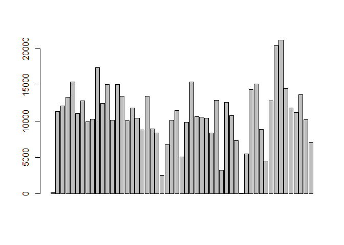

# Reproducible Research: Peer Assessment 1


## Loading and preprocessing the data

```r
#load the dplyr and ggplot2 package
library(dplyr)
```

```
## 
## Attaching package: 'dplyr'
## 
## The following objects are masked from 'package:stats':
## 
##     filter, lag
## 
## The following objects are masked from 'package:base':
## 
##     intersect, setdiff, setequal, union
```

```r
#load data
data <- read.csv("F:\\gitRespository\\RepData_PeerAssessment1\\activity.csv")
#remove the NA in steps variable
good<-complete.cases(data$steps)
activityData<-tbl_df(data[good,])
```


## What is mean total number of steps taken per day?

```r
#group the data by date
by_date<-group_by(activityData,date)
#caculate the totles steps per day
TotalStepsPerDay<-summarise(by_date,sumSteps=sum(steps))
#plot histogram
hist(TotalStepsPerDay$sumSteps)
```

 

```r
#plot barplot
barplot(TotalStepsPerDay$sumSteps)
```

 

```r
#calculate the mean of the total number of steps per day
mean(TotalStepsPerDay$sumSteps)
```

```
## [1] 10766.19
```

```r
#calculate the median of the total number of steps per day
median(TotalStepsPerDay$sumSteps)
```

```
## [1] 10765
```


## What is the average daily activity pattern?

```r
#caculate the mean steps within every interval
by_interval<-group_by(activityData,interval)
MeanStepsPerInterval<-summarize(by_interval,meanSteps=mean(steps))
with(MeanStepsPerInterval,plot(interval,meanSteps,xlab="interval",
                               ylab="meansteps",type="l"))
```

 

```r
#The maximum number of averaqge steps
filter(MeanStepsPerInterval,meanSteps==max(MeanStepsPerInterval$meanSteps))$interval
```

```
## [1] 835
```


## Imputing missing values
The total number missing value in the dataset

```r
colName<-names(data)
sumNA=0
for(col in colName){
    sumNA=sumNA+sum(!complete.cases(data[,col]))
}
print(sumNA)
```

```
## [1] 2304
```

Create a new dataset that the missing value is filled with 
   the mean value of the interval

```r
newData<-tbl_df(data)
for(i in 1:length(good)){
    if(!good[i]){
        cint<-newData[i,]$interval
        newData[i,]$steps<-filter(MeanStepsPerInterval,
                                  interval==cint)$meanSteps
    }
}
```

Calculate and report the mean and median total number of steps taken per day on the new data


```r
#group the data by date

newData_by_date<-group_by(newData,date)
#caculate the totles steps per day
newData_TotalStepsPerDay<-summarise(newData_by_date,sumSteps=sum(steps))
#plot histogram
hist(newData_TotalStepsPerDay$sumSteps)
```

 

```r
#plot barplot
barplot(newData_TotalStepsPerDay$sumSteps)
```

 

```r
#calculate the mean of the total number of steps per day
mean(newData_TotalStepsPerDay$sumSteps)
```

```
## [1] 10766.19
```

```r
#calculate the median of the total number of steps per day
median(newData_TotalStepsPerDay$sumSteps)
```

```
## [1] 10766.19
```

## Are there differences in activity patterns between weekdays and weekends?
Creete a new factor variable indicating the day is weekday or not

```r
library(lubridate)
newData2<-mutate(newData,isWeekday=wday(date))
newData2$isWeekday<-sapply(newData2$isWeekday,function (x){
    if(x==1 |x==7){
         "weekend"
    }else{
        "weekday"
    }
        
})
newData2$isWeekday<-as.factor(newData2$isWeekday)
```

Make a panel plot containing a time series plot (i.e. type = "l") 
of the 5-minute interval (x-axis) and the average number of steps taken, 
averaged across all weekday days or weekend days (y-axis). 

```r
library(lattice)
by_int_isweek<-group_by(newData2,interval,isWeekday)
newData2_group<-summarize(by_int_isweek,meanSteps=mean(steps))
xyplot(meanSteps~interval|isWeekday,data = newData2_group,layout=c(1,2),type="l")
```

 


